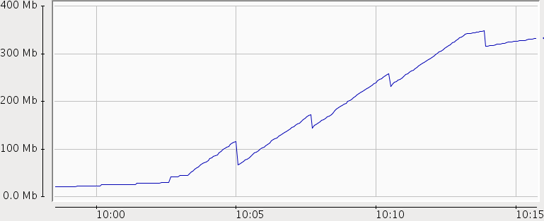
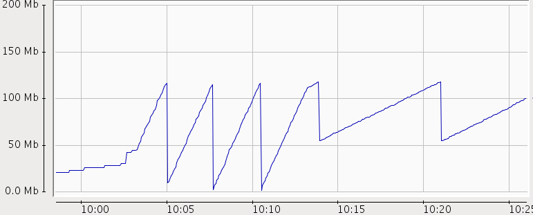
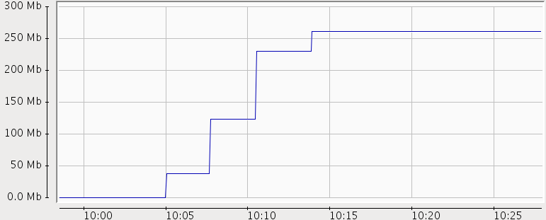

# OBJECTIVE

Primary purpose of this lab contain:

* Show Generational Heap Structure
* How Garbage Collection move Object between Generational Heap section(Eden,S0,S1,Tenured)

# PREREQUISITE

* Maven 3.0 or latter
* Eclipse
* java("1.6.0_31", Java HotSpot(TM) Server VM)
* Linux OS(Linux localhost.localdomain 2.6.43.8-1.fc15.i686.PAE #1 SMP Mon Jun 4 20:21:39 UTC 2012 i686 i686 i386 GNU/Linux)

# DESCRIPTION

* Install and Configure Maven

http://maven.apache.org

* Install Java

java be installed under /usr/java/jdk1.6.0_31/bin

* Build `heapusage` project, generate `heapusage.jar`

Navigate to jvm/heap/heapusage folder, execute maven commands to generate archhive jar:

~~~
mvn clean install
~~~ 

* Start heapusage application

Run the following commands will start heapusage application:

~~~
/usr/java/jdk1.6.0_31/bin/java -Dcom.sun.management.jmxremote -Xms400m -Xmx400m -Xmn150m -XX:PermSize=64m -XX:MaxPermSize=64m -verbose:gc -Xloggc:gc-heapusage.log -XX:+PrintGCDetails -XX:+PrintGCDateStamps -jar ./target/heapusage.jar 300 2000
~~~

> NOTE: heapusage application increase heap with 1MB size continuely till OutOfMemory happened

> NOTE: heapusage application has 2 Integer parameters, the first parameter hints heap increase times(each times 1 MB byte add to heap), the second parameter hints time interval. for example, above 300, 2000 means heap will increase 300 times, and time interval is 2000 milliseconds

The heapusgae will prompt the following message:

~~~
Press Enter to increase heap 300 times(each times 1MB), time interval 2000 milliseconds
~~~

Please note that do not press Enter directly, we will do this after `jconsole`, `jvisualvm`,`jmap` are set up correctly.

Account for heapuagae referred JVM OPTS:

. -Dcom.sun.management.jmxremote - Enables jconsle
. -Xms400m - Sets the initial heap size is 400 MB
. -Xmx400m - Sets the maximum heap size is 400 MB
. -Xmn150m - Sets the size of the Young Generation is 150 MB
. -XX:PermSize=64m - Sets the starting size of the Permanent Generation is 64 MB
. -XX:MaxPermSize=64m - Sets the maximum size of the Permanent Generation is 64 MB
. -verbose:gc -Xloggc:gc-heapusage.log -XX:+PrintGCDetails -XX:+PrintGCDateStamps - Enables Garbage Collection log 

# PROCEDURES

## Start jconsole

~~~
/usr/java/jdk1.6.0_31/bin/jconsole
~~~

* The jconsole UI will pop up, select `heapusgae.jar`, click connect button.

* In Memory page we record the Heap, Non-Heap, Eden, Survivor, Old Gen, Code Cache, Perm Gen referenced size
** Heap Memory Usage - Used, Committed, Max
** Memory Pool "PS Eden Space" - Used, Committed, Max
** Memory Pool "PS Survivor Space" - Used, Committed, Max
** Memory Pool "PS Old Gen" - Used, Committed, Max
** Non-Heap Memory Usage - Used, Committed, Max
** Memory Pool "Code Cache" - Used, Committed, Max
** Memory Pool "PS Perm Gen" - Used, Committed, Max

## Use jmap print heap summary

* Use below commands to print java heap summary

~~~
/usr/java/jdk1.6.0_31/bin/jmap -heap <PID> > jmap-heapusage-heap.out
~~~

> NOTE: `PID` should be heapuasage PID, `jmap-heapusage-heap.out` contain all heap summary, which will be generated in current folder

Check the output file jmap-heapusage-heap.out, record the details of Heap Configuration(MinHeapFreeRatio,MaxHeapFreeRatio,MaxHeapSize,NewSize,MaxNewSize,OldSize,NewRatio,SurvivorRatio,MaxPermSize), record the size of Heap Usage(Eden Space,From Space,To Space,PS Old Generation,PS Perm Generation).

[jmap-heapusage-heap.out](jmap-heapusage-heap.out)

## Start jvisualvm

~~~
/usr/java/jdk1.6.0_31/bin/jvisualvm
~~~

> NOTE: The first time Visual VM runs, it will do a calibration of your system, UI Dialog may pop up, you need click ok button in each poped Dialog.

* Install Visual GC

Visual GC plugin for Visual VM provides a graphical representation of the garbage collectors activity in the JVM, we need install Visual GC to Visual VM, install procedure as below:

. From the menu select Tools --> Plugins, the Plugins Dialog pop up
. In Available Plugins page, select Visual GC, click install button, the Plugin Installer Wizard pop up
. In Plugin Installer Wizard, click next finisih the installation
. First, right click the `com.kylin.jvm.lab.heap.Runner` in the Local applications list of the Applications tab. Select Open.
. The application is loaded into Visual VM. Notice a number of tabs are loaded on the right side of the interface. Click the Visual GC tab.
. The Visual GC tab shows all the activity going on in the Garbage Collector. You can watch as the Eden space is filled up and data is moved between the two survivor spaces S1 and S0. In addition, graphs and stats of related to the garbage collector are shown at the right.

## Use gedit open Garbage Collection log 

~~~
gedit gc-heapusage.log &
~~~

> Note that start heapusage app generate `gc-heapusage.log` in app run folder; gedit will send a notification when the opened file was modified, so we can chack the GC log if GC happened

## Press Enter in heapusage start Terminal

* Screenshot from visualvm

Above diagram show Survivor S0, Eden, Tenured be used

* Screenshot from jconsole

Above diagram show Heap Memory Usage

Above diagram show PS Eden Space Usage

Above diagram show Tenured Space Usage

* jmap output

[jmap-heapusage-heap.out](jmap-heapusage-heap.out)

* JVM Garbage Collection log

[gc-heapusage.log](gc-heapusage.log) 

